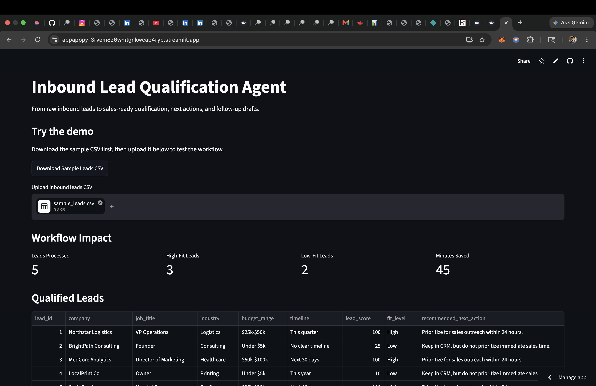

# Inbound Lead Qualification Agent

A lightweight sales and marketing operations workflow that turns raw inbound leads into a CRM-ready qualification file with lead scores, fit levels, qualification reasons, recommended next actions, and draft follow-up emails.

## Live Demo

Try the deployed Streamlit app here:

https://appapppy-3rvem8z6wmtgnkwcab4ryb.streamlit.app/

## Project Goal

The goal is to simulate how a marketing or revenue operations team can reduce manual lead qualification work.

The workflow:

1. Reads inbound lead data from a CSV
2. Scores each lead based on company size, title, budget, and timeline
3. Classifies leads as High, Medium, or Low fit
4. Explains the qualification reason
5. Recommends the next sales action
6. Generates a draft follow-up email
7. Produces a CRM-ready output file

## App Screenshot

## Business Impact

In the sample workflow:

- 5 inbound leads processed
- 3 high-fit leads identified
- Manual qualification time estimated at 10 minutes per lead
- Automated workflow time estimated at 1 minute per lead
- Estimated time saved: 45 minutes across 5 leads

This demonstrates a reduction from 50 minutes of manual review to 5 minutes of automated workflow time.

## Tech Stack

- Python
- Pandas
- Streamlit
- CSV-based CRM simulation

## How to Run

Install dependencies:

    python3 -m pip install -r requirements.txt

Run the backend workflow:

    python3 -m workflows.run_qualification

Run the Streamlit app:

    python3 -m streamlit run app/streamlit_app.py

Then upload:

    data/sample_leads.csv

## Output

The final output file is:

    data/final_qualified_leads.csv

It includes:

- Lead score
- Fit level
- Qualification reason
- Recommended next action
- Draft follow-up email

## n8n Automation Assets

This repo also includes an `n8n/` folder with demo-safe automation assets:

- `n8n/README.md`
- `n8n/workflow-outline.md`
- `n8n/test-webhook-payload.json`

These files describe how the Streamlit MVP can be extended into an automation workflow using a webhook, lead qualification logic, CRM or Google Sheets update, email draft generation, and high-fit lead notification.

## Automation Roadmap

The current version works as a Streamlit MVP. The next planned layer is an n8n automation workflow.

Planned automation flow:

- Form submission
- Lead data captured
- Lead qualification logic runs
- High-fit leads flagged
- CRM or Google Sheet updated
- Follow-up email draft generated
- Sales notification sent

Full workflow plan: `docs/n8n-workflow-plan.md`

## Next Improvements

- Add n8n automation workflow
- Connect Google Sheets as a lightweight CRM
- Add Gmail draft creation
- Add high-fit lead notifications
- Add charts for lead source and fit-level distribution

## Portfolio Positioning

This project is designed for marketing analyst, growth analyst, GTM analyst, business analyst, and marketing operations roles.

It demonstrates lead qualification logic, workflow automation, business impact measurement, Python implementation, and CRM-style output generation.
